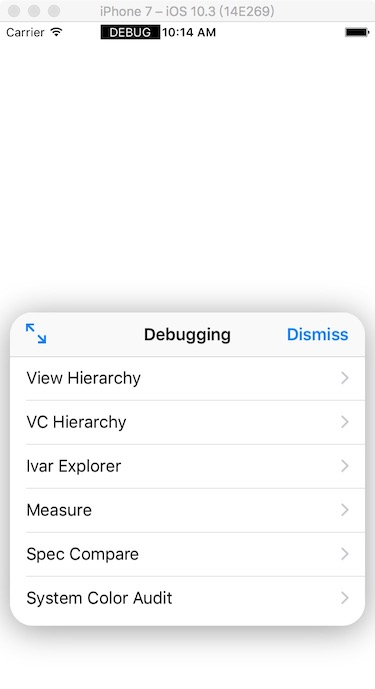

# AppleDebugTool
- - - - 
此工具是苹果私有的Debug 调试工具,idea 来自[链接](http://ryanipete.com/blog/ios/swift/objective-c/uidebugginginformationoverlay/)

>警告
> 此工具仅限于 Debug 阶段使用,在上线时最好移除,因为可能调用私有API而导致审核无法通过.
- - - - 
## ScreenShots




## Example usage
* 添加 AppleDebugTool 到项目中
* 在 Appdelegate的didFinishLaunchingWithOptions中添加
```
AppleDebugTool.shared.show()
AppleDebugTool.shared.debugToolsPos = .topLeft
```
* 在 Appdelegate 中添加方法:
```
   override func touchesBegan(_ touches: Set<UITouch>, with event: UIEvent?) {
        let location = ((event?.allTouches! as NSSet!).anyObject() as? UITouch)?.location(in: self.window)
        if UIApplication.shared.statusBarFrame.contains(location!) {
            AppleDebugTool.shared.debugBtnTapped()
        }
    }
```
## Realease log
* 17.05.28 -- first commit

## To Do
* Cocoapods 支持
* 移除 touchBegan方法,让使用更加简单
